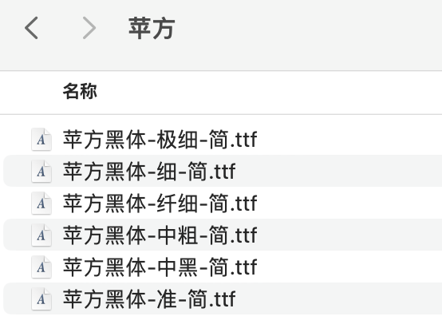
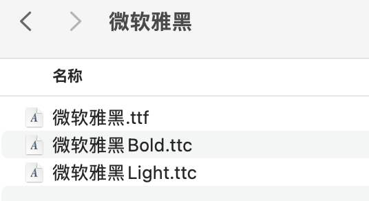
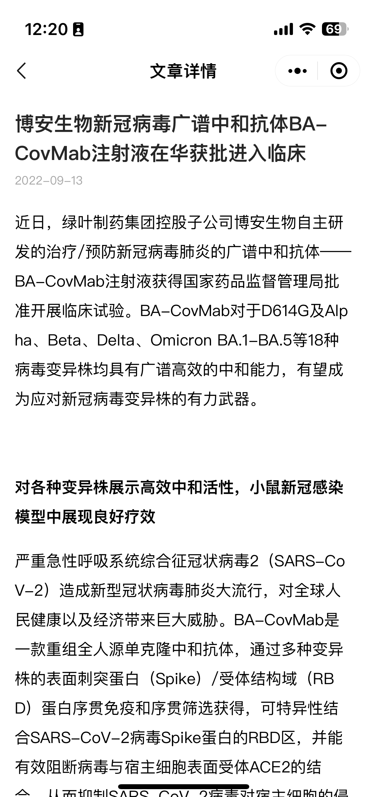
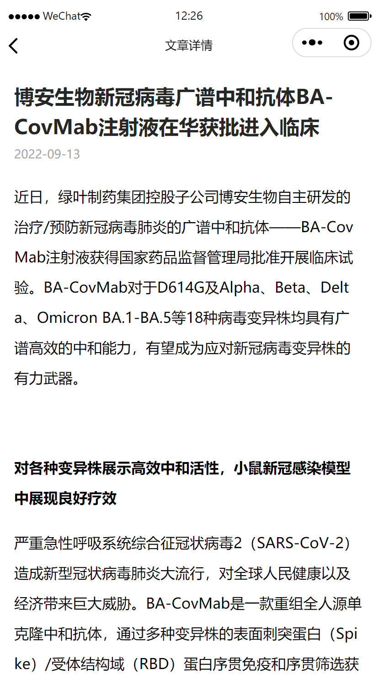

# 字重适配

打开蓝湖我们可以看到，设计图中最常见的字重 `font-weight` 有三种：`400`、`500`、`600`。
其中默认字重是 `400`，而 `500`、`600` 字重在显示上表现为线条更粗，通常用于表示强调的语义。

但是，有些情况下我们可能发现 `400` 字重和 `500` 字重在显示上没有任何区别，只有把字重加到 600，才能看出区别。
实际上，这是字体所提供的字重不完整的原因。

设计师通常使用苹果电脑，他们的系统字体可以准确还原 `500` 这种字重，但在 Windows 电脑上的显示则不尽人意。
所以，我们在开发时需要充分考虑到字体与字重的关系，尽可能的分场合进行适配。

## 字体与字重

字重 `font-weight` 是 CSS 中表述文字线条粗细的属性。可以在 [此 MDN 页面](https://developer.mozilla.org/zh-CN/docs/Web/CSS/font-weight) 查看其详细介绍。
它的生效方式比较特殊：通常来说，一款字体必须提供了某种字重的字体文件，它的这种字重才能生效，所以说字重的设置和字体是有相关性的。

Windows 系统自带字体 “微软雅黑” 只提供了 3 个字重：`100`、`400`、`700`；
苹果 iOS、macOS 等系统自带字体 “苹方” 提供了 6 个字重：`100`、`200`、`300`、`400`、`500`、`700`；
安卓系统自带的字体，取决于系统厂商，现在已经有较多字体支持多种字重了，如 “思源黑体”、“方正兰亭黑”。




以上两张图是两款字体的字体文件，可以看到，苹方字体提供了 6 个字体文件，而微软雅黑只有 3 个字体文件。
这就是苹方字体支持更多 `font-weight` 的原因。

## 体会

这里给一个直观的例子演示两种字体字重的区别：

<code src="@/interactive/font-font-weight/pingfang.tsx"></code>
<code src="@/interactive/font-font-weight/yahei.tsx"></code>

注意点开查看源码，找到其中的 CSS 文件。可以看出，在 CSS 文件中使用 `@font-face` 定义字体时，便可以指定它的字重：

```less | pure
/** 节选自 yahei.css */
@font-face {
  font-family: 'yahei';
  src: url('yahei-400.ttf') format('truetype');
  /** 👇🏻 这里就是定义字体时指定的字重 */
  font-weight: 400;
}
```

苹方字体没有 `600` 字重，所以 `600` 字重和 `700` 字重的显示效果是一样的；
微软雅黑字体因为只有三种字重，因此它是 `100`、`200`、`300` 字重显示一样，`400`、`500` 字重显示一样，`600`、`700` 字重显示一样。

从这里可以看出：
浏览器在多种字重之间存在一种 “fallback” 机制，确保当我们选用某一种字重后，即使当前字体不支持，也能**就近**使用相近的字重来显示它。
**但这个规则不明确，比如它无法解释为什么明明 `300` 字重更接近 `400`，但是微软雅黑却会使用 `100` 字重的字形来显示。**

## 字重的选取机制

深入研究，我们才能得知，具体的机制是这样：

- 如果 CSS 指定了 `400`-`500` 之间的字重，浏览器没有找到当前指定的字重的话，则在 `400`-`500` 这个区间内按从小到大寻找一个可用的字重；如果未找到可用的字重，则先从 `400` 开始往小了找，还找不到则从 `500` 开始往大了找；
- 如果 CSS 指定了小于 `400` 的字重，找不到对应字重的情况下会往小了找可用的字重，实在找不到再开始往大了找；
- 如果 CSS 指定了大于 `500` 的字重，找不到对应字重的情况下会往大了找可用的字重，实在找不到再开始往小了找。

原来在指定了小于 400 或是大于 500 的字重后，浏览器便会优先考虑 “往小” 或者是 “往大” 了匹配可用字重，而不管某个字重是否更接近。

---

其实 `font-weight` 还提供了几个可选值：

- `normal`：这是默认值，表示正常粗细，与 `400` 字重等效；
- `bold`：表示加粗，与 `700` 字重等效；
- `lighter`：这不是一个字重绝对值，而是相对值，它表示 **“相比当前字重而言，加粗一个级别”**；
- `bolder`：这不是一个字重绝对值，而是相对值，它表示 **相比当前字重而言，变细一个级别**。

这里的 `lighter` 和 `bolder` 是比较 “好用” 的属性值，它始终会考虑选用更小或更大的字重。
示例：

<code src="@/interactive/font-font-weight/relative-pingfang.tsx"></code>
<code src="@/interactive/font-font-weight/relative-yahei.tsx"></code>

可以看出，除非找不到更小或更大的字重了，否则 `lighter` 或 `bolder` 始终能找到另一种字重。

## 实践

因为例如 Windows 之类的设备无法正常展示 `500` 这种字重，所以我们要根据场合来具体开发：

- 如果文案是用做 “标题”、“强调” 等用途的，一定要和通常的字重体现出差别时：我们不要使用 `500` 而是使用 `bolder` 来取代之，这样做避免了微软雅黑字体无法显示 `500` 字重导致无区分度，在微软雅黑等字体下会自动使用更粗一级的字重，比如使用 `700`；
- 如果文案是用做 “内容” 等用途的，如果字重无需体现出突出语义，此时直接使用 `500` 便没问题。

## 医脉同道中的应用

医脉同道小程序发现页文章，是一个富文本渲染，其中存在 “标题”、“加粗文本” 等内容。
考虑到用户的设备有可能不支持部分字重（例如老安卓，字重不支持 `500`），因此在此类场景字重均规范化使用 `bolder` 字重来避免文字强调样式无效。

举例：


  

